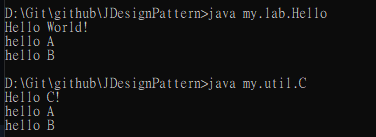

### 20200921

#### 安裝

簡單確認安裝成功與否 
open cmd 
輸入`java`  `javac`

#### what is class 

a template of object  物件樣板

動態屬性
靜態屬性

透過實體化 -->轉變為物件

人 -- > 
動態屬性:吃飯、變老、走動 =>method (function)
靜態屬性:年齡髮色 => property (變數)

程式語言 演化
OOP-->物件導向

##### 現代程式語言兩種元素

1.語法
2.類別使用、組合

#### 開發需要的類別

1. 自訂 來自客戶端需求

2. 來自官方 jdk lib

3. 第三方套件 來自開源
   - https://commons.apache.org/
   
- https://poi.apache.org/

#### java lib的三個版本   

1. se-standard eidition : stand alone app
    `App-java base`
2. ee-enterprose edition : sever side application
    `App-app server -java base`
3. me-micro edition : cdc(手機 已沒落)/cldc(硬體 也沒落)

#### 物件導向目的

 關注點分離

開放性問題: 你要怎麼把500行的程式換成物件導向

1. 分門別類
2. [內聚力(Cohesion and) 與耦合力(Coupling)](https://blog.cwke.org/2010/11/cohesion-and-coupling.html) 目標：高內聚 低耦合

class path 類別路徑

#### 名詞解釋

##### jdk 

Java development  kit

開發工具()+jre+jvm+javac 命令 (用以編譯jar檔)

##### jvm

跨平台的核心機器 編譯byte code (.class)

##### jre 

java 命令 (用以執行、啟動 jvm)

java runtime evironment 最基本的java執行環境 (官方程式庫+jvm)

##### jvms 

JDK Version Manager (JVMS) for Windows

https://github.com/ystyle/jvms

cd下載資料夾 執行 `.\jvms.exe init`

how to install and switch jdk. see:

- run cmd or powershell as administrator
- `jvms rls` *list available jdk version for download*
- `jvms install 1.8.0_31` *install jdk 1.8.0_31*
- `jvms ls` *list installed jdk*
- `jvms switch 1.8.0_31` *switch jdk version to 1.8.0_31*

### 20200928

#### Java Identifier 命名

##### 命名對象

class method variable label(這啥????)

##### 命名規則

1. 首字: _ $ 字母

2. 次字:+數字

3. 不能是

   1. Reserved Word :保留值 (true/false/null)

   2. key Word:語法(if else for)

##### 通則

class/method/variable:駝峰式

Constant 全大寫+底線

##### 方法組成 method

必要:名稱、回傳(void、data Type)

非必要:作用域(修飾字) 參數 異常宣告

完整method : `修飾字 回傳ˊ˙值 名稱 (參數) 異常宣告 {}`

例外method :entry point : Main Method 

1. public static
2. 命名必須式main
3. 必須是void
4. 參數必須是string[]

#### 類別組成 class
#### 參數組成 variable
#### 套件組成 Package
1. 組織類型.組織名稱.系統.功能.子功能
   Com.tsbank.loan.credit.----

2. .class
   放在相對應的pak的資料夾
   
3. FQCN :java my.lab.Hello (package.className) 

   此時不需要附檔名

#### 引用 Import

1. A use B
2. Syntax 
   1. 單.class : import pkg.className;
   2. 單 pkg:import.pkg.* 例:Hello.class
3. Error : 1.Target Access Level
4. 可以省略
   1. A、B在同一個pkg 例:C.class
   2. B在 java.lang中(預設import)

